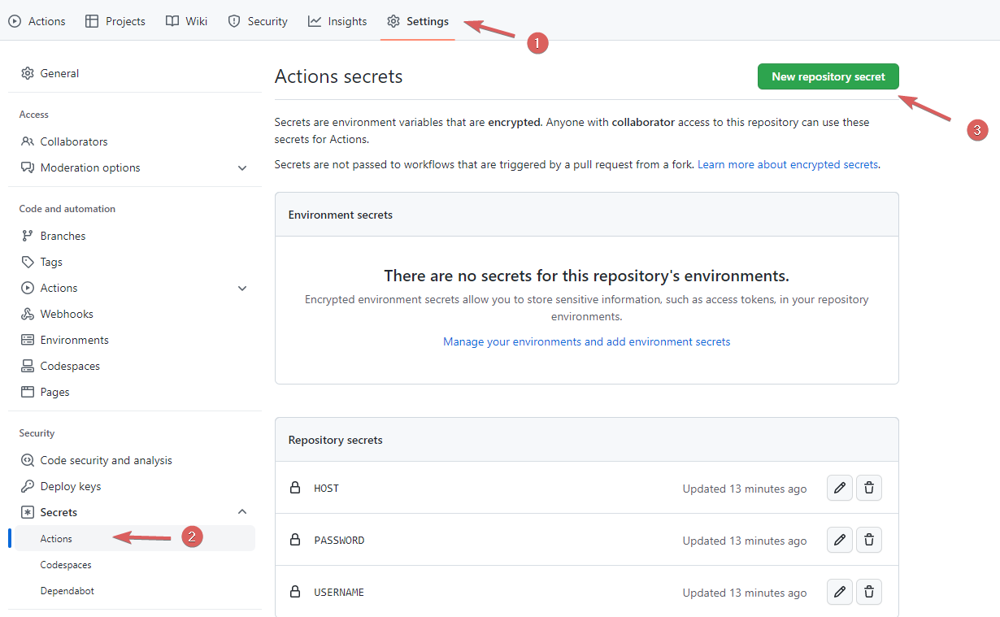

# Github-actions-demo

## Create action file

Create actionName.yml file under path .github/workflows/

```yml
name: scp files
on: [push]
jobs:
  build:
    name: Build
    runs-on: ubuntu-latest
    steps:
    - uses: actions/checkout@master
    - name: copy file via ssh password
      uses: appleboy/scp-action@master
      with:
        host: ${{ secrets.HOST }}
        username: ${{ secrets.USERNAME }}
        password: ${{ secrets.PASSWORD }}
        port: 22
        source: "./"
        target: "/home/ubuntu"
```
[appleboy/scp-action](https://github.com/marketplace/actions/scp-files)

### on

Event trigger

```yml
// single event
on: push

// Multiple events
on: [push,pull_request]
```


### run-on
operating system Image for building.

Availabletypes are
* ubuntu-latest, ubuntu-18.04, or ubuntu-16.04
* windows-latest or windows-2019
* macos-latest or macos-10.15

### job

Integration of multiple actions

### steps

Each job consists of multiple step, which are executed from top to bottom.

### uses

Use the action directly in the market.

### Run

Start a shell to execute the command.

```yml
// single command
- name: Install Dependencies
  run: npm install

// Multiple command
- name: Clean install dependencies and build
  run： |
    npm ci
    npm run build
```

## Add Secret environment variables



Use in yaml file：

```yml
password: ${{ secrets.PASSWORD }}
```
